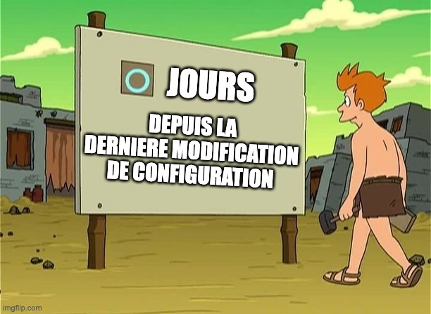

Qui suis-je ?
===
<!-- column_layout: [1, 3, 2, 1] -->

<!-- column: 1 -->

<!-- new_lines: 2 -->

**Benoit Fernandez**

Tech Lead

**Onepoint**
<!-- column: 2 -->

<!-- new_lines: 2 -->

<!-- reset_layout -->

<!-- end_slide -->

Mon parcours
===
<!-- pause -->
<!-- column_layout: [1, 1] -->

<!-- column: 0 -->
# Expérience
<!-- pause -->
Java/Angular depuis plusieurs années
<!-- pause -->
Spécialisé 95% frontend depuis 4-5 ans
<!-- pause -->
Utilisation d'IntelliJ IDEA
<!-- pause -->

<!-- column: 1 -->
# Ce qui me motive
<!-- pause -->
Passionné par l'**apprentissage** et l'**expérimentation**
<!-- pause -->
Recherche de **l'état "optimal" de concentration** (flow)
<!-- reset_layout -->

<!-- end_slide -->

Neovim, c'est quoi ?
===

<!-- pause -->
<!-- column_layout: [1, 1] -->

<!-- column: 0 -->
# Origines
<!-- pause -->
**vi** (1976) - Premier éditeur modal UNIX
<!-- pause -->
**Vim** (1991) - Vi IMproved
<!-- pause -->
**Neovim** (2014) - Fork moderne de Vim
<!-- pause -->

<!-- column: 1 -->
# Philosophie commune
<!-- pause -->
Efficacité et minimalisme
<!-- pause -->
Séparation modes navigation/édition
<!-- pause -->
Personnalisation

<!-- 
speaker_note: |
  Vi a été créé par Bill Joy en 1976, intégré dans tous les systèmes UNIX.
  Vim (Vi IMproved) ajoute de nombreuses fonctionnalités essentielles :
  - Édition multi-fichiers et multi-fenêtres
  - Annulation multi-niveaux (undo/redo)
  - Coloration syntaxique avancée
  - Complétion intelligente
  - Recherche avec expressions régulières
  - Macros et automatisation
  - Configuration via vimrc
  - Extensible via plugins (VimL/VimScript)
  - Initialement développé pour AmigaOs, d'où son support multi-plateformes amélioré
  - Prise en charge de nombreux encodages
-->

<!-- end_slide -->

Le coeur de Vim/Neovim
===

<!-- new_lines: 1 -->
<!-- pause -->
<!-- column_layout: [1, 1] -->

<!-- column: 0 -->

# Les modes

<!-- pause -->
**Normal**: navigation et manipulation
<!-- pause -->
**Insertion**: saisie de texte

<!-- pause -->
**Visuel**: sélection de texte

<!-- pause -->
**Commande**: actions spéciales

<!-- column: 1 -->
<!-- pause -->
# Langage d'édition

<!-- pause -->
**Verbes** : actions (d = delete, c = change, y = yank/copy)

<!-- pause -->

**Modificateurs** : quantité, direction (2, i, a)

<!-- pause -->
**Objets**: sur quoi agir (w = word, { = block)

<!-- end_slide -->

<!-- end_slide -->

Neovim : les avancée clés
===

<!-- new_lines: 1 -->
<!-- pause -->
Architecture entièrement asynchrone dès sa conception
<!-- pause -->
Lua comme langage de script principal (vs VimScript)
<!-- pause -->
API externe robuste permettant des intégrations avancées
<!-- pause -->
Support natif des protocoles modernes de développement (LSP/DAP)

<!-- speaker_note: |
Neovim apporte des améliorations majeures à Vim :
- Architecture moderne avec API asynchrone
- Support natif des Language Server Protocols (LSP) pour l'auto-complétion, la navigation, etc.
- Support du Debug Adapter Protocol (DAP) pour le débogage
- Terminal intégré
- Interface graphique détachable (GUI)
- Meilleure gestion des événements et des tâches en arrière-plan
- Communauté très active et innovante
- Configuration plus simple et plus puissante en Lua
- Architecture asynchrone native (plus complète que celle ajoutée à Vim 8)
- Meilleure intégration avec les outils modernes de développement
-->

<!-- end_slide -->
Le Changement Inattendu
===

<!-- new_lines: 2 -->
<!-- column_layout: [1, 1] -->

<!-- column: 0 -->

<!-- pause -->
Reprise après un congé paternité
<!-- pause -->
Changement de projet
<!-- pause -->
Environnement dans une VDI sous windows
<!-- pause -->

<!-- column: 1 -->

<!-- end_slide -->

La passerelle : IdeaVim
===

<!-- column_layout: [1, 2] -->

<!-- column: 0 -->

<!-- new_lines: 2 -->
<!-- pause -->
Plugin pour IntelliJ
<!-- pause -->
Émulation de Vim
<!-- pause -->

<!-- column: 1 -->

<!-- end_slide -->

<!-- end_slide -->

Le déclic
===

<!-- new_lines: 2 -->
<!-- column_layout: [1, 1] -->
<!-- column: 0 -->
<!-- pause -->
Projet perso en Zig
<!-- pause -->
Mauvais support dans IntelliJ
<!-- pause -->
Communauté Zig essentiellement sur Neovim

<!-- column: 1 -->

<!-- pause -->

<!-- end_slide -->
Démonstration
===

<!-- jump_to_middle -->
🏠 Tour du propriétaire

<!-- end_slide -->

Par où commencer ?
===
<!-- column_layout: [1, 1] -->

<!-- column: 0 -->
# Stratégie progressive
<!-- pause -->
Commencer avec IdeaVim ou VSCodeVim
<!-- pause -->
Partir de Kickstart ou d'une distribution
<!-- pause -->
Garder des "filets de sécurité"
<!-- pause -->
<!-- column: 1 -->
# Mindset gagnant
<!-- pause -->
Accepter la courbe d'apprentissage
<!-- pause -->
Célébrer les petites victoires
<!-- pause -->
<!-- reset_layout -->
# Le secret ultime : **LA MOTIVATION !**

<!-- end_slide -->
Ressources
===

<!-- column_layout: [1, 1] -->

<!-- column: 0 -->
# Apprendre

 [ThePrimeagen](@ThePrimeagen)

 [TJ DeVries](@teej_dv)

 **Neovim from Scratch**

󰖟 **LazyVim**

<!-- column: 1 -->
# Communauté

 **r/neovim**

  **Discord Neovim**
<!-- end_slide -->
Merci
===
<!-- column_layout: [1, 1] -->

<!-- column: 0 -->
**GitHub**

<!-- column: 1 -->
**feedback**

